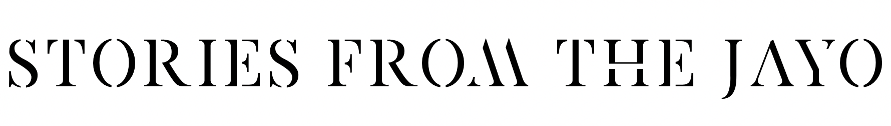

- **Жанр**: 3D, Adventure, Steampunk; 
- **Движок**: Unity 2020;
- **Платформа**: PC (Windows/MacOS); 
- **Тип игрока**: Core;
- **Рейтинг**: 18+, R; 
- **Длительность**: 4-6 часов

## О чём игра?

Вы, Тихомир Вузолев, оказались весьма везучими. Вам выпал шанс отправиться в 45-ом году после Падения Империи с профессором археологии и географии Уладой Остревиденовой на корабле в экспедицию на поиски новых земель в качестве её ассистента! Впереди долгое путешествие и неизвестно, сколько времени должно пройти, чтобы корабль нашёл берега новых земель. Однако вы замечаете, что на корабле кроме экипажа, Вас и госпожи Остревиденовой, находится ещё и спонсор экспедиции - болезненного вида торговый магнат - без видимой на то причины. И Вам предстоит выяснить его истинные мотивы, войдя в доверие членов команды и услышав их истории о старом мире, в котором наступила эпоха стимпанка, когда балом правит паровой двигатель, а людские души начали подвергаться декаденсу.

## Документация

- [Лорбук](/Lorebook)
- [Дизайн-документ](/DesignDoc)
- [Сценарий](/Script)
- [Арты](/Arts)
